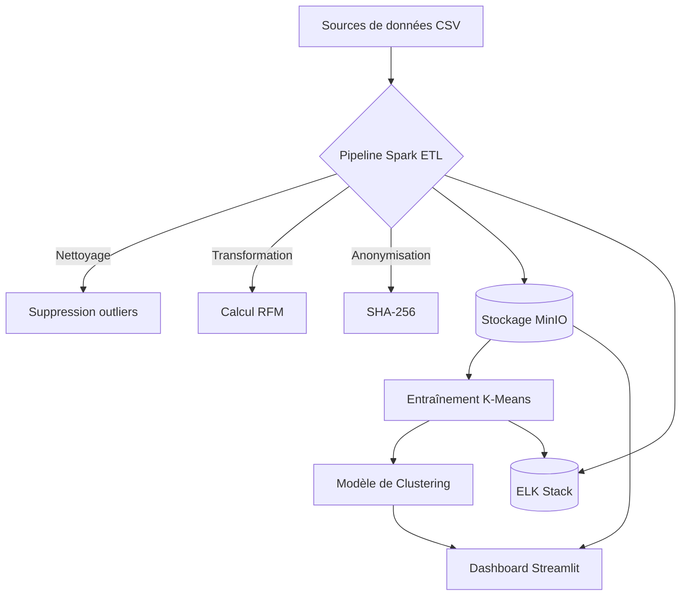

# 🚀 Projet MSPR AMAZING - Plateforme de Segmentation Client

---

## 🌟 Aperçu du Projet

Ce projet vise à concevoir, développer et industrialiser une solution d’Intelligence Artificielle permettant de **catégoriser les clients** d'une marketplace (Amazing) **en fonction de leur comportement d’achat et de navigation**.  
Le tout est mis en place dans un environnement **conteneurisé**, surveillé, et connecté à un data lake.

Le projet inclut :

-   🧠 **Modélisation IA pour classification clients**
-   ⚙️ **Pipeline ETL de traitement de données comportementales**
-   🧪 **Analyse descriptive & feature engineering avancé**
-   📦 **Conteneurisation (Docker/Kubernetes)**
-   📊 **Surveillance avec ELK + Grafana**
-   ☁️ **Stockage S3-compatible avec MinIO**
-   📈 **Dashboard interactif avec recommandations stratégiques**

Il permet également de :

-   Segmenter les clients selon leurs habitudes réelles (et non démographiques)
-   Générer des insights marketing/actionnables
-   Industrialiser la chaîne complète de traitement et de prédiction

---

## 🏗️ Architecture Technique



---

## 📁 Structure du projet

Voir le script `setup_project.sh` pour comprendre l'arborescence du projet.

---

## 🚀 Démarrage du projet

```bash
docker-compose up -d
```

---

## 📦 DEPENDENCIES

### Installation des dépendances Python

```bash
python3 -m venv venv
source venv/bin/activate
python3 -m pip install --upgrade pip
pip install -r requirements.txt
pip freeze > requirements.txt
```

---

### Variables d'environnement à définir dans `.env` :

#### 🔥 Spark

```
SPARK_MASTER=spark://spark-master:7077
SPARK_MASTER_PORT=8080
SPARK_SUBMITTER_PORT=4040
SPARK_WORKER_CORES=2
SPARK_WORKER_MEMORY=6G
WORKER_MAX_MEMORY=8G
```

#### ☁️ MinIO (Stockage S3-compatible)

```
MINIO_HOSTNAME=minio
MINIO_PORT=9000
MINIO_ACCESS_KEY=minio
MINIO_SECRET_KEY=minio123
MINIO_BUCKET_NAME=mspr
```

#### 🔍 Elasticsearch

```
ES_HOST=elasticsearch
ES_PORT=9200
```

#### 📈 Grafana

```
GF_USER=admin
GF_USER_PASSWORD=admin
GF_PORT=3000
```

---

## 📊 Objectifs & Fonctionnalités

---

### 🔍 Analyse & Traitement des Données

-   Étude descriptive des données issues des logs d’événements du site Amazing (oct. 2019 - avr. 2020)
-   Nettoyage, agrégation et transformation des événements par utilisateur (`user_id`)
-   Feature engineering avancé : fréquence d’achat, saisonnalité, montant dépensé, typologie produit...

### 🧠 Modélisation IA

-   Classification des utilisateurs selon leurs comportements en ligne
-   Algorithmes : Clustering K-Means
-   Réduction dimensionnelle (ACP) & sélection de variables
-   Évaluation des modèles via métriques de clustering, validation croisée, visualisation

### 🏗️ Industrialisation

-   Déploiement de l’algorithme dans un container Docker
-   Traitement des futurs fichiers d’événements en autonomie via l’ETL
-   Stockage des résultats dans S3 MINIO

### 📡 Monitoring

-   Intégration de la stack ELK pour collecter les logs de traitement
-   Dashboards Grafana pour suivre les performances du pipeline

---

## 🔐 RGPD & Confidentialité

-   Traitement sur base de données **anonymisées**
-   Respect des règles RGPD dans la conception des pipelines et du modèle
-   Pas de traitement de données sensibles ni d’identification directe des utilisateurs

---

## 📊 Dashboard Interactif

-   Visualisation des clusters
-   Prédiction en temps réel
-   Recommandations marketing ciblées

---

## 📬 Contact & Informations légales

---

-   **Email** : [contact@chagest.com](mailto:contact@chagest.com)
-   **Informations légales** : Projet à finalité pédagogique basé sur des données publiques et anonymisées.

---

**Version** : 1.0  
© 2025 - Tous droits réservés
